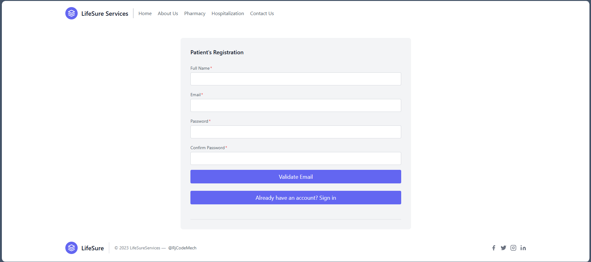
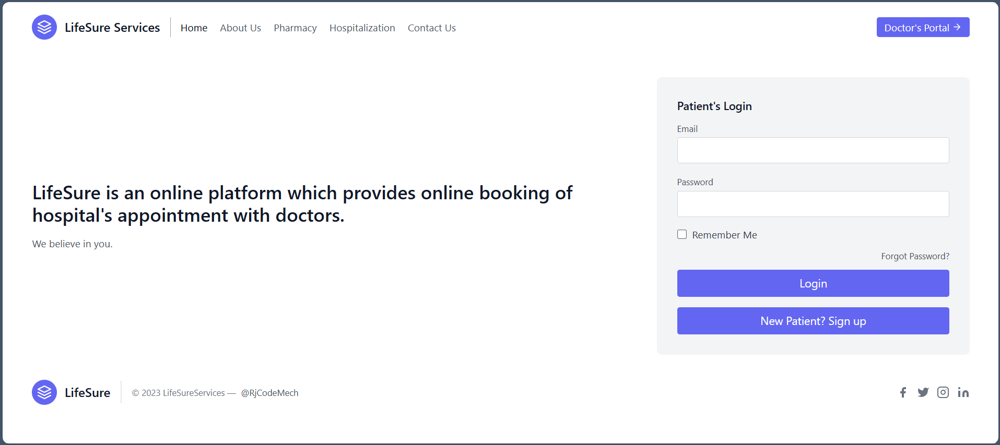
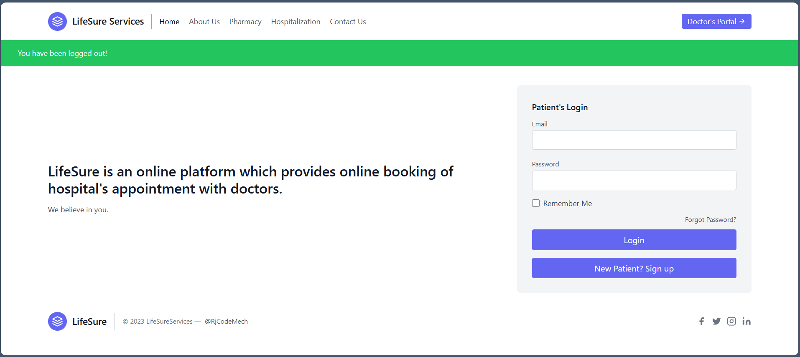
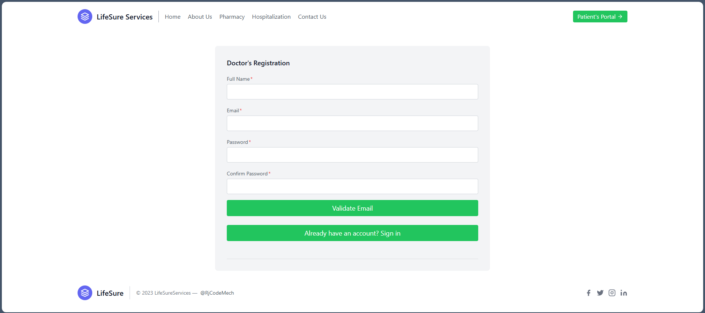
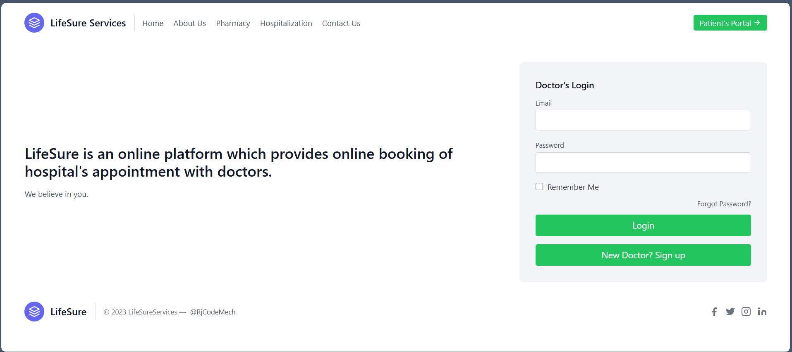
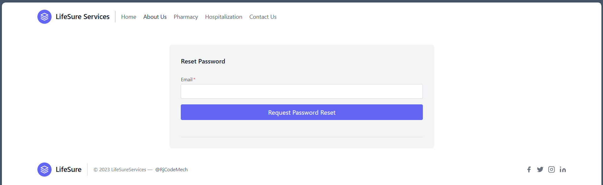

# LifeSure Services

A Flask web app for managing services and appointments.

## 🛠️ Tech Stack
- Flask
- Bootstrap
- SQLite

## 🔍 Preview

### 1. Patient Account

- **Registration:** [http://127.0.0.1:70/patient/patientregistration](http://127.0.0.1:70/patient/patientregistration)

  

- **Login:** [http://127.0.0.1:70/patient/login](http://127.0.0.1:70/patient/login)

  

- **Logout:** [http://127.0.0.1:70/patient/logout](http://127.0.0.1:70/patient/logout)

  

### 2. Doctor Account

- **Registration:** [http://127.0.0.1:70/doctor/patientregistration](http://127.0.0.1:70/doctor/patientregistration)

  

- **Login:** [http://127.0.0.1:70/doctor/login](http://127.0.0.1:70/doctor/login)

  

- **Logout:** [http://127.0.0.1:70/doctor/logout](http://127.0.0.1:70/doctor/logout)

  

### 3. Patient Login

- **Patient Profile:** [http://127.0.0.1:70/doctor/patientregistration](http://127.0.0.1:70/doctor/patientregistration)

  

- **Login:** [http://127.0.0.1:70/doctor/login](http://127.0.0.1:70/doctor/login)

  

- **Logout:** [http://127.0.0.1:70/doctor/logout](http://127.0.0.1:70/doctor/logout)

  

### 2. Doctor Account

- **Registration:** [http://127.0.0.1:70/doctor/patientregistration](http://127.0.0.1:70/doctor/patientregistration)

  

- **Login:** [http://127.0.0.1:70/doctor/login](http://127.0.0.1:70/doctor/login)

  

- **Logout:** [http://127.0.0.1:70/doctor/logout](http://127.0.0.1:70/doctor/logout)

  

### 3. About Us Page

- **About Us:** [http://127.0.0.1:70/aboutus](http://127.0.0.1:70/aboutus)

  

### 4. Reset Password

- **Reset Password:** [http://127.0.0.1:70/patient/resetpassword](http://127.0.0.1:70/patient/resetpassword)

  

